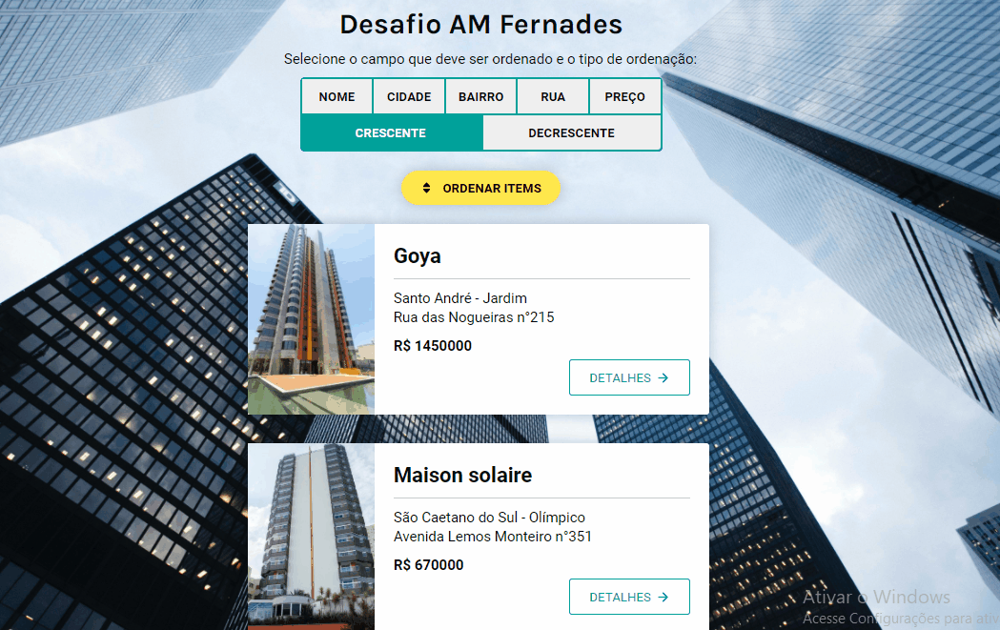
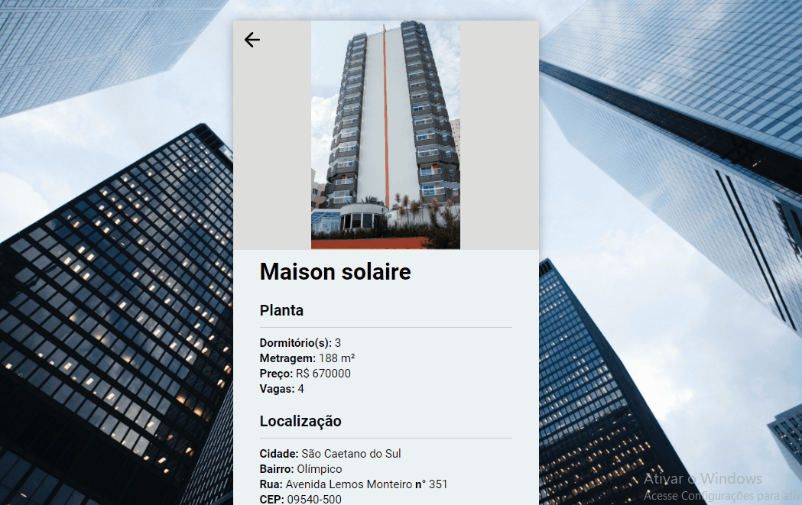

<p align="center">
  

  
  
  <a href="https://github.com/grochavieira/am-fernandes-challenge/commits/master">
    
  </a>
    
   

  <a href="https://github.com/grochavieira">
    
  </a>
  
 
</p>
<h1 align="center">
    Desafio AM Fernandes
</h1>

<h4 align="center"> 
	🚧  Aplicação Finalizada 🚧
</h4>

## 🏁 Tópicos

<p>
 👉<a href="#-sobre-o-projeto" style="text-decoration: none; "> Sobre</a> <br/>
👉<a href="#-funcionalidades" style="text-decoration: none; "> Funcionalidades</a> <br/>
👉<a href="#-layout" style="text-decoration: none"> Layout</a> <br/>
👉<a href="#-como-executar-o-projeto" style="text-decoration: none"> Como executar</a> <br/>
👉<a href="#-tecnologias" style="text-decoration: none"> Tecnologias</a> <br/>
👉<a href="#-autor" style="text-decoration: none"> Autor</a> <br/>
👉<a href="#user-content--licença" style="text-decoration: none"> Licença</a>
</p>

## 💻 Sobre o projeto

Uma página que faz requisição a API disponibilizada pela AM Fernandes e ordena os dados de acordo com alguns campos dos edifícios de forma crescente ou decrescente.

---

<a name="-funcionalidades"></a>

## ⚙️ Funcionalidades

- [x] Pagina Home
  - [x] Você pode realizar a ordenação dos dados:
    - [x] Escolhendo um dos seguintes campos (nome, cidade, bairro, rua e preço);
    - [x] Escolhendo a forma como serão ordenados (crescente ou decrescente);
    - [x] Pressionando o botão de ordenar items.
  - [x] Nos blocos dos prédios são apresentados:
    - [x] Algumas informações sobre o prédio (endereço, preço e fachada);
    - [x] Um botão que redireciona para a página de Detalhes.
  - [x] Tem um sistema de paginação que:
    - [x] Apresenta 10 items por página;
    - [x] Pode ser modificado pela variável limitPerPage.
  - [x] Tem uma indicação de loading para os blocos dos prédios quando:
    - [x] O usuário acessa a página pela primeira vez (ou atualiza);
    - [x] Quando os items são ordenados;
    - [x] Quando uma página é selecionada.
- [x] Pagina de Detalhes
  - [x] Apresenta um bloco contendo:
    - [x] Nome do prédio;
    - [x] Dados da Planta, se existir;
    - [x] Dados da Localização;
    - [x] Botão que redireciona para o google maps, apresentado as rotas da localização atual do usuário até o prédio em questão.
  - [x] Tem uma indicação de loading para o bloco quando a página é apresentada.

---

## 🎨 Layout

### Home

<div align="center">
    
</div>

### Ordenação

<div align="center">
    
</div>

### Paginação

<div align="center">
    
</div>

### Detalhes

<div align="center">
    
</div>

### Google Maps

<div align="center">
    
</div>

---

## 🚀 Como executar o projeto

Este projeto contém apenas uma parte:

1. Frontend (pasta web)

### Pré-requisitos

Antes de começar, você vai precisar ter instalado em sua máquina as seguintes ferramentas:
[Git](https://git-scm.com), [Node.js](https://nodejs.org/en/), [Yarn](https://classic.yarnpkg.com/en/docs/install).
Além disto é bom ter um editor para trabalhar com o código como [VSCode](https://code.visualstudio.com/)

#### 🧭 Rodando a aplicação web (Frontend)

```bash

# Clone este repositório
$ git clone https://github.com/grochavieira/am-fernandes-challenge.git

# Acesse a pasta do projeto no seu terminal/cmd
$ cd am-fernandes-challenge

# Vá para a pasta da aplicação Front End
$ cd web

# Instale as dependências
$ yarn

# Execute a aplicação em modo de desenvolvimento
$ yarn start

# A aplicação será aberta na porta:3000 - acesse http://localhost:3000

```

---

## 🛠 Tecnologias

As seguintes ferramentas foram usadas na construção do projeto:

#### **Website** ([React](https://reactjs.org/) + [TypeScript](https://www.typescriptlang.org/))

- **[React Router Dom](https://github.com/ReactTraining/react-router/tree/master/packages/react-router-dom)**
- **[Axios](https://github.com/axios/axios)**
- **[React Icons](https://react-icons.github.io/react-icons/)**
- **[React Spinners](https://github.com/davidhu2000/react-spinners)**
- **[SCSS](https://sass-lang.com/)**

> Veja o arquivo [package.json](https://github.com/grochavieira/am-fernandes-challenge/blob/master/web/package.json)

#### **Utilitários**

- Editor: **[Visual Studio Code](https://code.visualstudio.com/)**
- Teste de API: **[Insomnia](https://insomnia.rest/)**
- Ícones: **[Feather Icons](https://feathericons.com/)**, **[Font Awesome](https://fontawesome.com/)**
- Fontes: **[Karla](https://fonts.google.com/specimen/Karla)**, **[Roboto](https://fonts.google.com/specimen/Robto)**

---

<a name="-autor"></a>

## 🦸‍♂️ **Autor**

<p>
<kbd>
 
 </kbd>
 <br />
 <sub><strong>🌟 Guilherme Rocha Vieira 🌟</strong></sub>
</p>

[](https://www.linkedin.com/in/grochavieira/)
[](mailto:guirocha.hopeisaba@gmail.com)

---

## 📝 Licença

Este projeto esta sobe a licença [MIT](./LICENSE).

Feito com :satisfied: por Guilherme Rocha Vieira 👋🏽 [Entre em contato!](https://www.linkedin.com/in/grochavieira/)

---
